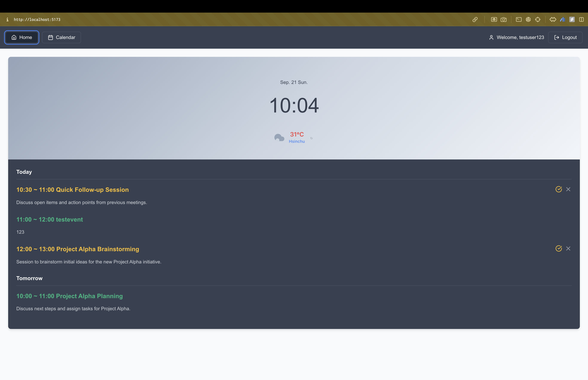
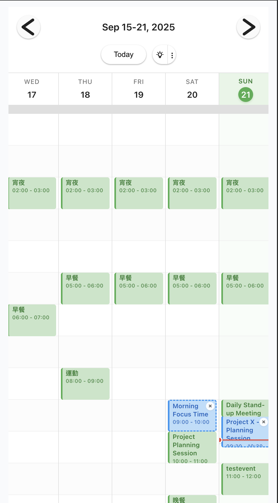
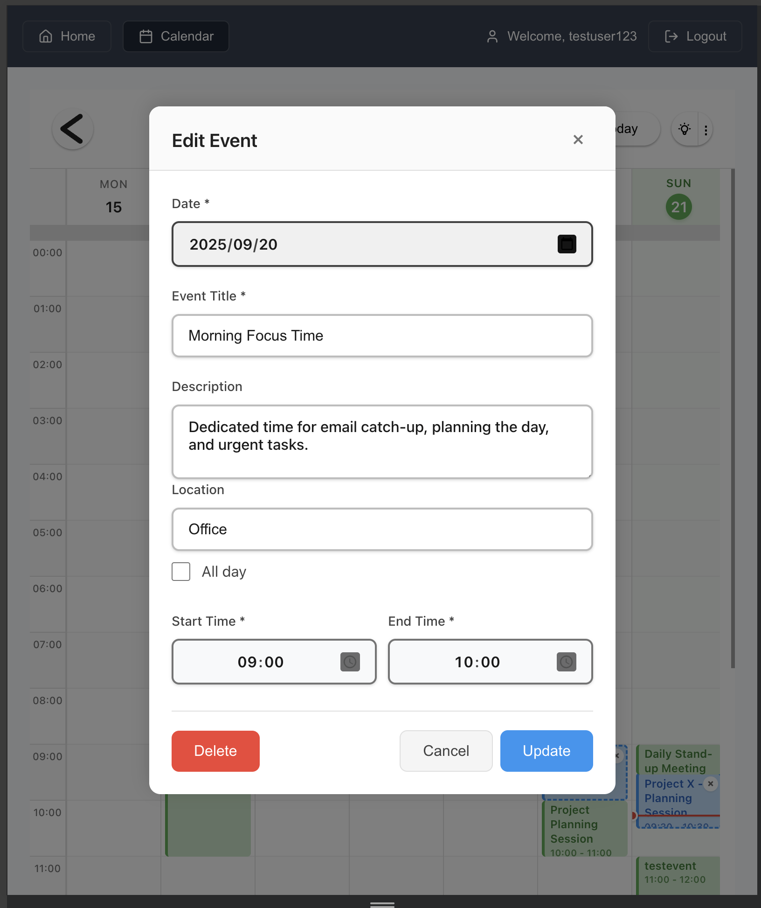

# mc-hackathon-frontend (CAIendar)

Enterprise-ready AI-powered calendar application built with **React + Vite**, integrating **GraphQL**, **DynamoDB**, **Google Calendar**, and **LLM**.
The project, called **CAIendar**, is designed as an **AI Calendar × Life Designer** to enhance employee onboarding and workplace experience by providing personalized scheduling, activity recommendations, and smart reminders.

---

## 🚀 Features

* **AI Scheduling** – Automatically generate optimized weekly schedules.
* **Company Activity Integration** – Join and track corporate events (sports days, family days, volunteer activities).
* **Context-Aware Recommendations** – Suggest activities based on workplace environment and lifestyle factors.
* **Smart Reminders & Suggestions** – Provide AI-driven notifications with actionable advice.
* **Enhanced Onboarding** – Improve employee retention and engagement through lifestyle and workplace support.

---

## 🛠 Tech Stack

* **Frontend**: React 18 + Vite
* **Language**: JavaScript (ES6+)
* **API**: GraphQL
* **Database**: DynamoDB
* **AI Engine**: LLM for intelligent scheduling and recommendations

---

## 📂 Project Structure

```
mc-hackathon-frontend/
├── CAIandar.pdf           # Project slide deck
├── dockerfile             # Container build config
├── example_env.txt        # Example environment variables
├── index.html             # Entry HTML file
├── package.json           # Project metadata & scripts
├── package-lock.json
├── pictures/              # Project screenshots
│   ├── add_events.jpg
│   ├── calendar.jpg
│   └── default_page.jpg
├── README.md              # Project documentation
├── src/                   # Source code
│   ├── App.jsx            # Root app component
│   ├── components/        # UI components (Calendar, Auth, Dashboard, etc.)
│   ├── contexts/          # Global state (AuthContext)
│   ├── hooks/             # Custom React hooks
│   ├── pages/             # Page-level components (DefaultPage, LoginPage)
│   ├── services/          # API & service modules (GraphQL, Firebase, Weather)
│   ├── styles/            # Global and component CSS
│   ├── test/              # Test setup & utilities
│   ├── index.css          # Global CSS
│   └── main.jsx           # Entry point
├── tsconfig.json          # TypeScript config
├── tsconfig.node.json     # TS config for Node
├── vite.config.js         # Vite config
└── vitest.config.js       # Testing config
```

---

## ⚙️ Setup & Installation

1. **Clone the repository**

   ```bash
   git clone https://github.com/your-org/mc-hackathon-frontend.git
   cd mc-hackathon-frontend
   ```

2. **Install dependencies**

   ```bash
   npm install
   ```

3. **Configure environment variables**
   Copy `example_env.txt` → `.env` and configure:

   ```env
   VITE_GRAPHQL_ENDPOINT=<your-api-endpoint>
   VITE_FIREBASE_API_KEY=<your-firebase-api-key>
   ```

4. **Build the project**

   ```bash
   npm run build
   ```

5. **Run locally**

   ```bash
   npm run dev
   ```

---

## 📸 Screenshots

* Default Page
  

* Calendar View
  

* Add Events Page
  

---

## 📑 Slides

The full project presentation is available here: [CAIandar.pdf](./CAIandar.pdf)

---

## 🔮 Future Development

* **Google OAuth Integration** – Streamline user authentication and reduce account creation friction.
* **Workflow Automation (n8n)** – Provide customizable workflows for different themes.
* **Communication Integration** – Extend notifications to Email and messaging platforms.
* **AI-Driven Event Broadcasting** – Enable group activity scheduling and AI-recommended event announcements.

---

## 👥 Contributing

* Fork the repository
* Create a branch: `git checkout -b feature/your-feature`
* Commit and open a PR

---

## 📜 License

This project is licensed under the MIT License.
